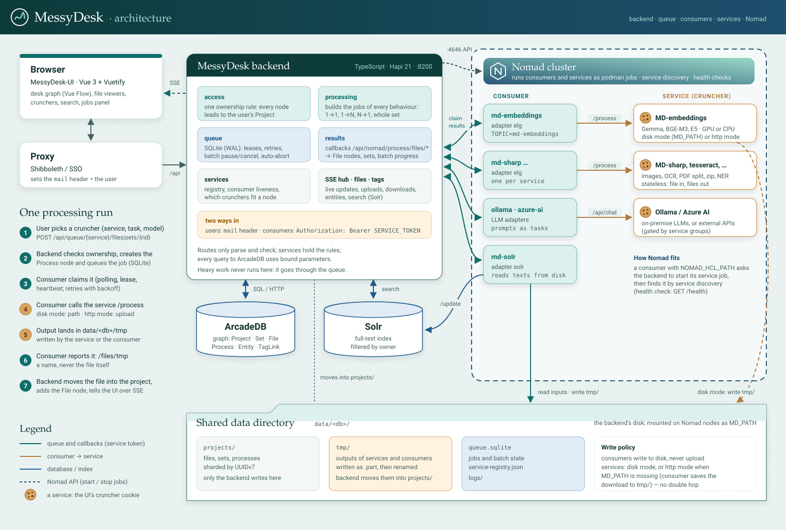

# System Overview

MessyDesk is a document processing platform built around a graph database. Users upload files into projects, apply processing services (OCR, NER, image manipulation, LLM prompts), and browse results as a derivation graph. The platform is split across multiple repositories with a message queue connecting them.

## Repositories

| Repository | Language | Role |
|------------|----------|------|
| `MessyDesk` | Node.js (ESM) | Backend API server, graph database management, queue orchestration |
| `MessyDesk-UI` | Vue 3 + Vite | Single-page frontend |
| `MD-consumers` | Node.js (ESM) | Adapter layer: translates queue messages into service HTTP calls and routes results back |
| `MD-text-base_fs` | Python (FastAPI) | Text processing service (wordcloud, split, stopwords, json2csv) |
| `MD-opencv` | Python (FastAPI) | Image ROI operations (extract, fill, blur, grayscale, border) |
| `MD-zip_fs` | Python (FastAPI) | ZIP file extraction and creation |
| `MD-finbert-ner` | Python (FastAPI) | Finnish NER via FinBERT model |

**[verified]** All repository roles confirmed by reading entry points and package.json/requirements.txt files.

## Infrastructure Dependencies

| Component | Image/Version | Port | Purpose |
|-----------|--------------|------|---------|
| ArcadeDB | `arcadedata/arcadedb:23.7.1` | 2480 | Graph database (vertices, edges, SQL+Cypher queries) |
| Apache Solr | `solr:9.7` | 8983 | Full-text search, core name `messydesk` |
| HashiCorp Nomad | (optional) | 4646 | Service orchestration for production deployments |

**[verified]** From `docker-compose.yml`. NATS removed in `sqlite-queue` branch.

## Component Interaction Diagram



([PNG](architecture.png))

```
┌─────────────────────────────────┐
│  MessyDesk-UI (Vue 3, :3000)   │
│  Vite dev proxy → :8200        │
└──────────┬──────────────────────┘
           │ HTTP /api, SSE /events
           ▼
┌──────────────────────────────────────────────┐
│  MessyDesk Backend (Hapi.js, :8200)          │
│  ┌──────────┐ ┌────────┐ ┌──────┐ ┌───────┐ │
│  │ ArcadeDB │ │ SQLite │ │ Solr │ │Nomad? │ │
│  │  :2480   │ │ queue  │ │:8983 │ │:4646  │ │
│  └──────────┘ └───┬────┘ └──────┘ └───────┘ │
└───────────────────┼──────────────────────────┘
                    │ HTTP /api/queue/claim
                    ▼
┌──────────────────────────────────────────────┐
│  MD-consumers (one process per service)      │
│  Polls backend queue API for jobs            │
│  Heartbeat + registration every 30s          │
└──────────┬───────────────────────────────────┘
           │ HTTP (service-specific API)
           ▼
┌──────────────────────────────────────────────┐
│  Services (FastAPI, md-sharp, Ollama, etc.)  │
│  Stateless; receives file, returns result    │
└──────────┬───────────────────────────────────┘
           │ HTTP callback
           ▼
  MessyDesk /api/nomad/process/files/*
  (result materialization, graph updates)
```

**[verified]** Data flow from `src/modules/queue/`, `src/modules/processing/` and `src/modules/results/`.

## Startup Sequence

`src/main.ts` (the composition root):

1. Load `src/config.ts`, create the logger and the data directory tree.
2. With `NOMAD` set, check Nomad (exit when unreachable).
3. Create the ArcadeDB database when missing, then ensure types, properties and indexes
   (`src/platform/arcade/schema.ts`), and the default admin `local.user@localhost`.
4. Open the SQLite queue and start its sweeper.
5. Load the service registry (`service-registry.json`) and the filters (`filters/*/filter.json`).
6. Build the services, register the auth strategies and routes, and start Hapi on `PORT`.

## Authentication

**Development mode** (`MODE=development`): every request is `DEV_USER` (default
`local.user@localhost`); 401 if that user does not exist, 503 if the database is down.

**Production mode**: the `mail` header, set by an upstream proxy (Shibboleth etc.), is trusted
and looked up with `UsersService.find` (by e-mail, or by RID when it starts with `#`).
Consumers use the separate `service` strategy (bearer `SERVICE_TOKEN`). See
[backend structure](backend-structure.md#authentication).

**Authorization**: ownership through the graph. `AccessService.findOwned(rid, user)` follows the
node's outgoing `DERIVED_FROM`/`BELONGS_TO` edges to a Project that `HAS_OWNER` the user. Admin
routes also check `access === 'admin'`.

## Technology Choices

| Decision | Choice | Notes |
|----------|--------|-------|
| Language | TypeScript | compiled with `tsc` to `dist/`; `npm run build`, `npm start` |
| Web framework | Hapi 21 | `@hapi/inert` (static files), `@hapi/boom` (errors); SSE written directly (`src/platform/sse/hub.ts`) |
| Database | ArcadeDB (HTTP API) | SQL with bound parameters through `fetch`; Cypher only in legacy mode |
| Queue | SQLite (WAL mode) via `node:sqlite` | retries, leases, batch auto-abort |
| Frontend framework | Vue 3 + Vuetify 3 | |
| Frontend build | Vite | Dev proxy to backend on :8200 |
| Module system | ESM | Node.js >= 22.5 (`node:sqlite`) |
| Service framework (Python) | FastAPI | CORS enabled globally; multipart file I/O |
| Logging | Winston + daily-rotate-file | JSON format, 14-day retention, 20MB rotation |
| Tests | `node:test` | `test/contract/` (HTTP, any backend), `test/unit/` |

**[verified]** from `package.json` and `src/`.
